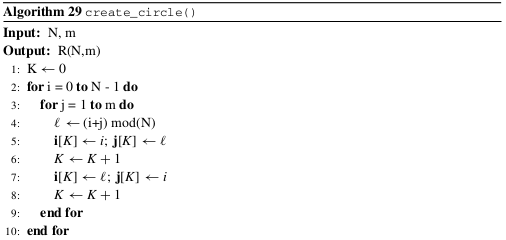
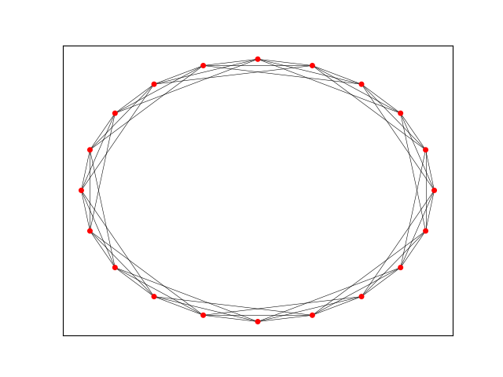
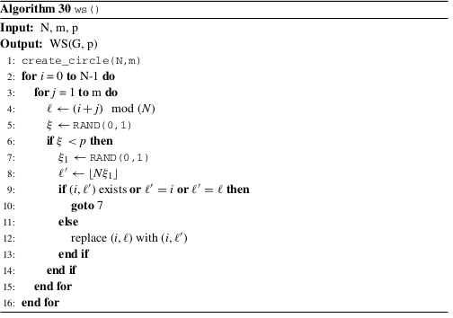
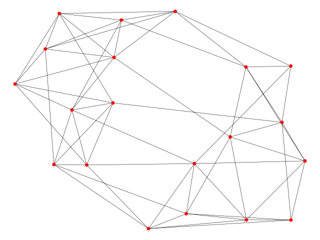

#  The Watts–Strogatz Small-World Model

Se presenta la implementación de un algoritmo que construye gráficas de mundo pequeño de acuerdo al modelo Watts–Strogatz. 

Inicialmente se construye una gráfica circular con el siguiente algoritmo:
 
 

Posteriormente implementamos el sigueinte algoritmo para construir la gráfica de mundo pequeño Watts–Strogatz.
 
 
### Ejecución del programa

El programa recibe dos argumentos. El primero corresponde a la cantidad de nodos en la gráfica mientras que el segundo es la cantidad de aristas del nodo  i a sus  m vecinos.

```
python Watts–Strogatz-model.py nodos m
```
